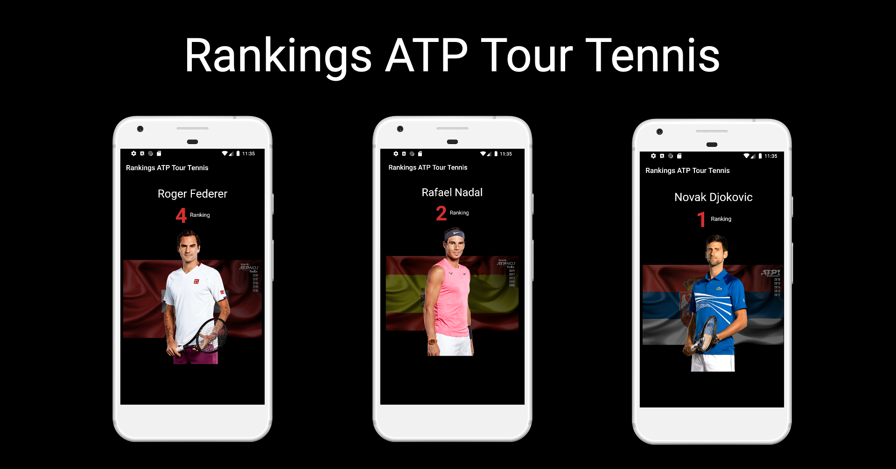

# Rankings ATP Tour Tennis - Hilt 

The sample cover the following topics:

* Tips and Tricks using dependency injection in Android projects with [Dagger](https://dagger.dev/) & [Hilt](https://developer.android.com/training/dependency-injection/hilt-android).
* [UI Testing](https://developer.android.com/training/testing/ui-testing/espresso-testing) with [Hilt Testing](https://developer.android.com/training/dependency-injection/hilt-testing?authuser=1)
* [Screenshot Testing](http://facebook.github.io/screenshot-tests-for-android/#getting-started) with [Hilt Testing](https://developer.android.com/training/dependency-injection/hilt-testing?authuser=1)
* [Flow](https://kotlin.github.io/kotlinx.coroutines/kotlinx-coroutines-core/kotlinx.coroutines.flow/-flow/index.html) & [StateFlow](https://kotlin.github.io/kotlinx.coroutines/kotlinx-coroutines-core/kotlinx.coroutines.flow/-state-flow/) 

# Dependency Injection 

I collected tips and tricks that will help you get approaches used to apply [DI](https://martinfowler.com/articles/injection.html) in android apps.

## Hilt

Hilt provides a standard way to use DI in your application by providing containers for every Android class in your project and managing their lifecycles automatically.

You can see my [Hilt](https://github.com/erikjhordan-rey/ATP-Rankings-di/tree/master) implementation on this example:

[dagger-hilt-example](https://github.com/erikjhordan-rey/ATP-Rankings-di/tree/master) 

#### Learn Dependency Injection with Hilt

* [hilt-android - doc](https://developer.android.com/training/dependency-injection/hilt-android)
* [dependency injection on android with hilt - blog](https://medium.com/androiddevelopers/dependency-injection-on-android-with-hilt-67b6031e62d)
* [hilt - Android Dependency Injection - talk](https://www.youtube.com/watch?v=B56oV3IHMxg)
* [migrating to Hilt - doc](https://dagger.dev/hilt/migration-guide)
* [android Hilt - codelab](https://codelabs.developers.google.com/codelabs/android-hilt/#1)
* [migrating your Dagger app to Hilt - codelab](https://codelabs.developers.google.com/codelabs/android-dagger-to-hilt/#0)
* [an opinionated guide to Dependency Injection on Android (ADS '19) - talk](https://www.youtube.com/watch?v=o-ins1nvbDg&t=216s)
* [hilt — Adding components to the hierarchy - blog](https://medium.com/androiddevelopers/hilt-adding-components-to-the-hierarchy-96f207d6d92d)
* [hilt-dagger.dev - doc](https://dagger.dev/hilt/)
* [android-hilt - example](https://github.com/googlecodelabs/android-hilt)
* [android-dagger-hilt - example](https://github.com/googlecodelabs/android-dagger-to-hilt)

## Dagger

There are a few ways you can create a ViewModel instance. Since it’s a lifecycle-aware component, it needs a reference of the lifecycle owner such as an activity or fragment, so the samples contain some practices commonly used on the Android community.

Goal | Example |
--- | --- | 
Basic implementation using [ViewModelProvider.Factory](https://codelabs.developers.google.com/codelabs/kotlin-android-training-view-model/#0) to instantiate [ViewModels](https://developer.android.com/topic/libraries/architecture/viewmodel). | [dagger-viewmodel-factory](https://github.com/erikjhordan-rey/ATP-Rankings-di/tree/dagger-viewmodel-factory) |
Classic implementation to provide dependencies using [constructor injection and modules](https://dagger.dev/dev-guide/) | [dagger-viewmodel-module](https://github.com/erikjhordan-rey/ATP-Rankings-di/tree/dagger-viewmodel-module) |
Avoid arguments in [Dagger - Modules](https://dagger.dev/hilt/modules.html) using [BindsInstance](https://dagger.dev/api/2.10/dagger/BindsInstance.html) | [dagger-viewmodel-binds-instance](https://github.com/erikjhordan-rey/ATP-Rankings-di/tree/dagger-viewmodel-binds-instance) |
Provides a [ViewModel](https://developer.android.com/topic/libraries/architecture/viewmodel) using [Multibindings](https://dagger.dev/dev-guide/multibindings.html) | [dagger-viewmodel-multibindings](https://github.com/erikjhordan-rey/ATP-Rankings-di/tree/dagger-viewmodel-multibindings) |

#### Learn Dependency Injection with Dagger

(At this time probably you're an expert using dagger but if not these are great resources to deep in.)

* [dependency Injection the masterpiece on Android - slides](https://speakerdeck.com/erikjhordan_rey/dependency-injection-the-masterpiece-on-android)
* [dagger - doc](https://dagger.dev/)
* [dagger google - talk](https://www.youtube.com/watch?v=oK_XtfXPkqw)
* [dagger basics - android-doc](https://developer.android.com/training/dependency-injection/dagger-basics?authuser=1)
* [dagger-android - example](https://github.com/erikjhordan-rey/Kata-Dagger2-Android)
* [dagger-mvp - example](https://github.com/erikjhordan-rey/Dagger2-MVP-Sample)
* [dependency Injection - blog-spanish](https://erikjhordan-rey.github.io/blog/2016/04/25/ANDROID-dependency-injection.html)
* [flexible dependency - slides](https://speakerdeck.com/erikjhordan_rey/flexible-dependency)

## Testing

#### Screenshot Testing

`./gradlew executeScreenshotTests`

#### Instrumental Testing with Espresso 

`./gradlew connectedAndroidTest`

#### Screenshot Testing + Instrumental Testing

`./gradlew connectedCheck executeScreenshotTest`

Maybe you noticed some test are pretty similar as:

*showEmptyViewWhenThereAreNotPlayersScreenShot* & *showEmptyViewWhenThereAreNotPlayers*
    
**Instrumental Test**    
*showEmptyViewWhenThereAreNotPlayers*: is ensuring the view is shown

**Screenshot Test**  
*showEmptyViewWhenThereAreNotPlayersScreenShot*: is ensuring the view is shown in the correct place on the screen

Yes, probably you can replace an instrumental test with a screenshot test in some scenarios in another ones you can be benefited from both.

## Demo

Do you want to contribute?
--------------------------

Feel free to report or add any useful feature, I will be glad to improve it with your help.

Developed By
------------

* Erik Jhordan Rey  - <erikjhordan.rey@gmail.com> 

License
-------

    Copyright 2020 Erik Jhordan Rey

    Licensed under the Apache License, Version 2.0 (the "License");
    you may not use this file except in compliance with the License.
    You may obtain a copy of the License at

       http://www.apache.org/licenses/LICENSE-2.0

    Unless required by applicable law or agreed to in writing, software
    distributed under the License is distributed on an "AS IS" BASIS,
    WITHOUT WARRANTIES OR CONDITIONS OF ANY KIND, either express or implied.
    See the License for the specific language governing permissions and
    limitations under the License.
